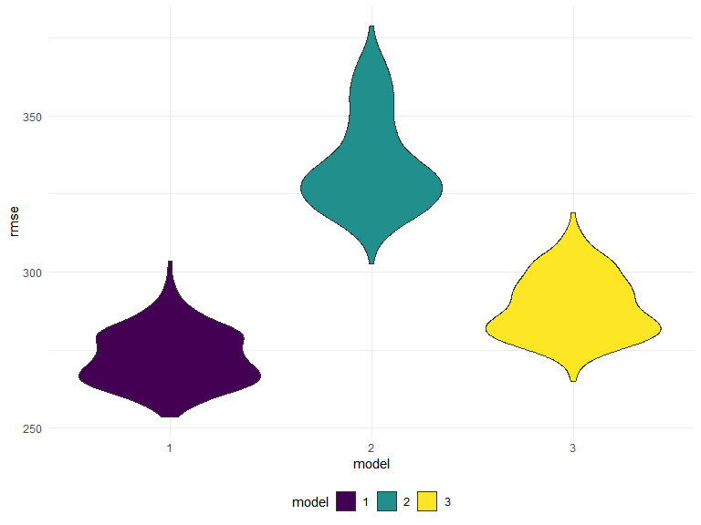

p8105_hw6_rc3521
================
Runze Cui
2022-11-30

## Problem 2

We imported the data firstly

``` r
homicide = read_csv("https://raw.githubusercontent.com/washingtonpost/data-homicides/master/homicide-data.csv")
```

Now, we create a city_state variable (e.g. “Baltimore, MD”), and a
binary variable indicating whether the homicide is solved. Besides, we
omit cities Dallas, TX; Phoenix, AZ; Kansas City, MO; and Tulsa, AL.

``` r
homicide_df = 
  homicide %>% 
  janitor::clean_names() %>%
   mutate(
     city_state = str_c(city, state, sep = ", "),
     resolved = if_else(disposition %in% "Closed by arrest", 1, 0),
     reported_date = as.Date(as.character(reported_date), format = "%Y%m%d"),
     victim_age = as.numeric(victim_age),
     victim_race = fct_relevel(victim_race, "White")
    ) %>%
  filter(!city_state %in% c("Dallas, TX", "Phoenix, AZ", "Kansas City, MO", "Tulsa, AL"),
         victim_race %in% c("White", "Black")) %>%
  relocate(city_state)
```

Fit the logistic regression by `glm` function and obtain required
measures by `broom::tidy` function

``` r
baltimore_log = 
  homicide_df %>%
  filter(city_state == "Baltimore, MD") %>%
  glm(resolved ~ victim_age + victim_race + victim_sex, data = ., family = binomial())

## get estimates and confidence interval of the adjusted odds ratio
baltimore_log = 
  baltimore_log %>% 
  broom::tidy(conf.int = TRUE, conf.level = 0.95) %>% 
  mutate(OR = exp(estimate),
         ci_lower = exp(conf.low),
         ci_upper = exp(conf.high)) %>%
  select(term, log_OR = estimate, OR, ci_lower, ci_upper, p.value)

baltimore_log %>% 
  knitr::kable(digits = 3)
```

| term             | log_OR |    OR | ci_lower | ci_upper | p.value |
|:-----------------|-------:|------:|---------:|---------:|--------:|
| (Intercept)      |  1.152 | 3.164 |    1.998 |    5.057 |   0.000 |
| victim_age       | -0.007 | 0.993 |    0.987 |    1.000 |   0.043 |
| victim_raceBlack | -0.842 | 0.431 |    0.305 |    0.606 |   0.000 |
| victim_sexMale   | -0.854 | 0.426 |    0.324 |    0.558 |   0.000 |

Based on the results above, keeping all other variables fixed, in
Baltimore, MD, and we observed that homicides in which the victim is
male are less likely to be resolved than those in which the victim is
female.

Now, run the logistic model for each city of data and obtain the
adjusted odd ratios and confidential intervals

``` r
all_log = 
  homicide_df %>% 
  select(city_state, victim_race, victim_age, victim_sex, resolved) %>%
  nest(data = -city_state) %>% 
  mutate(
    models = map(data, ~glm(resolved ~ victim_age + victim_race + victim_sex, data = ., family = binomial())),
    results = map(models, ~broom::tidy(., conf.int = TRUE, conf.level = 0.95))) %>% 
  select(-data, -models) %>%
  unnest(results) 
```

Generate a table for all of these data

``` r
all_log =
  all_log %>% 
  mutate(
         OR = exp(estimate),
         ci_lower = exp(conf.low),
         ci_upper = exp(conf.high)) %>%
    select(city_state, term, log_OR = estimate, OR, ci_lower, ci_upper, p.value) %>% 
  filter(term == "victim_sexMale")

 all_log %>% 
  knitr::kable(digits = 3)
```

| city_state         | term           | log_OR |    OR | ci_lower | ci_upper | p.value |
|:-------------------|:---------------|-------:|------:|---------:|---------:|--------:|
| Albuquerque, NM    | victim_sexMale |  0.570 | 1.767 |    0.825 |    3.762 |   0.139 |
| Atlanta, GA        | victim_sexMale |  0.000 | 1.000 |    0.680 |    1.458 |   1.000 |
| Baltimore, MD      | victim_sexMale | -0.854 | 0.426 |    0.324 |    0.558 |   0.000 |
| Baton Rouge, LA    | victim_sexMale | -0.964 | 0.381 |    0.204 |    0.684 |   0.002 |
| Birmingham, AL     | victim_sexMale | -0.139 | 0.870 |    0.571 |    1.314 |   0.511 |
| Boston, MA         | victim_sexMale | -0.395 | 0.674 |    0.353 |    1.277 |   0.226 |
| Buffalo, NY        | victim_sexMale | -0.653 | 0.521 |    0.288 |    0.936 |   0.029 |
| Charlotte, NC      | victim_sexMale | -0.123 | 0.884 |    0.551 |    1.391 |   0.600 |
| Chicago, IL        | victim_sexMale | -0.891 | 0.410 |    0.336 |    0.501 |   0.000 |
| Cincinnati, OH     | victim_sexMale | -0.917 | 0.400 |    0.231 |    0.667 |   0.001 |
| Columbus, OH       | victim_sexMale | -0.630 | 0.532 |    0.377 |    0.748 |   0.000 |
| Denver, CO         | victim_sexMale | -0.736 | 0.479 |    0.233 |    0.962 |   0.041 |
| Detroit, MI        | victim_sexMale | -0.541 | 0.582 |    0.462 |    0.734 |   0.000 |
| Durham, NC         | victim_sexMale | -0.208 | 0.812 |    0.382 |    1.658 |   0.576 |
| Fort Worth, TX     | victim_sexMale | -0.402 | 0.669 |    0.394 |    1.121 |   0.131 |
| Fresno, CA         | victim_sexMale |  0.289 | 1.335 |    0.567 |    3.048 |   0.496 |
| Houston, TX        | victim_sexMale | -0.341 | 0.711 |    0.557 |    0.906 |   0.006 |
| Indianapolis, IN   | victim_sexMale | -0.085 | 0.919 |    0.678 |    1.241 |   0.582 |
| Jacksonville, FL   | victim_sexMale | -0.329 | 0.720 |    0.536 |    0.965 |   0.028 |
| Las Vegas, NV      | victim_sexMale | -0.178 | 0.837 |    0.606 |    1.151 |   0.278 |
| Long Beach, CA     | victim_sexMale | -0.891 | 0.410 |    0.143 |    1.024 |   0.072 |
| Los Angeles, CA    | victim_sexMale | -0.413 | 0.662 |    0.457 |    0.954 |   0.028 |
| Louisville, KY     | victim_sexMale | -0.712 | 0.491 |    0.301 |    0.784 |   0.003 |
| Memphis, TN        | victim_sexMale | -0.324 | 0.723 |    0.526 |    0.984 |   0.042 |
| Miami, FL          | victim_sexMale | -0.663 | 0.515 |    0.304 |    0.873 |   0.013 |
| Milwaukee, wI      | victim_sexMale | -0.319 | 0.727 |    0.495 |    1.054 |   0.098 |
| Minneapolis, MN    | victim_sexMale | -0.054 | 0.947 |    0.476 |    1.881 |   0.876 |
| Nashville, TN      | victim_sexMale |  0.034 | 1.034 |    0.681 |    1.556 |   0.873 |
| New Orleans, LA    | victim_sexMale | -0.536 | 0.585 |    0.422 |    0.812 |   0.001 |
| New York, NY       | victim_sexMale | -1.338 | 0.262 |    0.133 |    0.485 |   0.000 |
| Oakland, CA        | victim_sexMale | -0.574 | 0.563 |    0.364 |    0.867 |   0.009 |
| Oklahoma City, OK  | victim_sexMale | -0.026 | 0.974 |    0.623 |    1.520 |   0.908 |
| Omaha, NE          | victim_sexMale | -0.961 | 0.382 |    0.199 |    0.711 |   0.003 |
| Philadelphia, PA   | victim_sexMale | -0.701 | 0.496 |    0.376 |    0.650 |   0.000 |
| Pittsburgh, PA     | victim_sexMale | -0.842 | 0.431 |    0.263 |    0.696 |   0.001 |
| Richmond, VA       | victim_sexMale |  0.006 | 1.006 |    0.483 |    1.994 |   0.987 |
| San Antonio, TX    | victim_sexMale | -0.350 | 0.705 |    0.393 |    1.238 |   0.230 |
| Sacramento, CA     | victim_sexMale | -0.402 | 0.669 |    0.326 |    1.314 |   0.255 |
| Savannah, GA       | victim_sexMale | -0.143 | 0.867 |    0.419 |    1.780 |   0.697 |
| San Bernardino, CA | victim_sexMale | -0.692 | 0.500 |    0.166 |    1.462 |   0.206 |
| San Diego, CA      | victim_sexMale | -0.884 | 0.413 |    0.191 |    0.830 |   0.017 |
| San Francisco, CA  | victim_sexMale | -0.498 | 0.608 |    0.312 |    1.155 |   0.134 |
| St. Louis, MO      | victim_sexMale | -0.352 | 0.703 |    0.530 |    0.932 |   0.014 |
| Stockton, CA       | victim_sexMale |  0.301 | 1.352 |    0.626 |    2.994 |   0.447 |
| Tampa, FL          | victim_sexMale | -0.214 | 0.808 |    0.340 |    1.860 |   0.619 |
| Tulsa, OK          | victim_sexMale | -0.025 | 0.976 |    0.609 |    1.544 |   0.917 |
| Washington, DC     | victim_sexMale | -0.371 | 0.690 |    0.465 |    1.012 |   0.061 |

Finally, we need to create a plot to show the estimated ORs and
confidential intervals for each city. Organize it based on the estimated
OR and comment the plot properly.

``` r
all_log %>% 
  mutate(city_state = fct_reorder(city_state, OR)) %>% 
  ggplot(aes(x = city_state, y = OR)) + 
  geom_point() +
  geom_errorbar(aes(ymin = ci_lower, ymax = ci_upper)) +
  theme(axis.text.x = element_text(angle = 60, hjust = 1)) +
   labs(
    title = "Adjusted OR and CI for Resolving Homicides Based on Victims' Gender",
    x = "City, State",
    y = "Odds Ratio"
  )
```


Clearly, assuming all other variables unchanged, homicides in which the
victim is male are relatively less likely to be resolved than those in
which the victim is female generally. Specifically, for most of cities,
the OR is less than 1, representing a decreasing trend of odds of
resolving a homicide when the victim is male compared with female. Some
city like Albequerque, Stockton, and Fresno, on the other hands, shows a
increased odds of resolving a homicide when the victim is male compared
with female.

## Problem 3

Loading and processing the data

``` r
birthweight_df = 
  read_csv("data/birthweight.csv") %>% 
  janitor::clean_names() %>%
  mutate(
        across(.cols = c(babysex, frace, malform, mrace), as.factor)
        ) %>%
  mutate(
    mrace = recode(mrace, 
                   `1` = "White", 
                   `2` = "Black", 
                   `3` = "Asian", 
                   `4` = "Puerto Rican", 
                   `8` = "Other"),
    frace = recode(frace, 
                   `1` = "White", 
                   `2` = "Black", 
                   `3` = "Asian", 
                   `4` = "Puerto Rican", 
                   `8` = "Other", 
                   `9` = "Unknown"),
    babysex = recode(babysex, 
                     `1` = "Male", 
                     `2` = "Female"),
    malform = ifelse(malform == "0", "absent","present")
    ) %>% 
  mutate(
    frace = fct_relevel(frace, "White"),
    mrace = fct_relevel(mrace, "White"),
    babysex = fct_relevel(babysex,"Female")
         ) %>% 
  select(bwt,everything())

head(birthweight_df, 10)
```

    ## # A tibble: 10 × 20
    ##      bwt babysex bhead blength delwt fincome frace gaweeks malform menarche
    ##    <dbl> <fct>   <dbl>   <dbl> <dbl>   <dbl> <fct>   <dbl> <chr>      <dbl>
    ##  1  3629 Female     34      51   177      35 White    39.9 absent        13
    ##  2  3062 Male       34      48   156      65 Black    25.9 absent        14
    ##  3  3345 Female     36      50   148      85 White    39.9 absent        12
    ##  4  3062 Male       34      52   157      55 White    40   absent        14
    ##  5  3374 Female     34      52   156       5 White    41.6 absent        13
    ##  6  3374 Male       33      52   129      55 White    40.7 absent        12
    ##  7  2523 Female     33      46   126      96 Black    40.3 absent        14
    ##  8  2778 Female     33      49   140       5 White    37.4 absent        12
    ##  9  3515 Male       36      52   146      85 White    40.3 absent        11
    ## 10  3459 Male       33      50   169      75 Black    40.7 absent        12
    ## # … with 10 more variables: mheight <dbl>, momage <dbl>, mrace <fct>,
    ## #   parity <dbl>, pnumlbw <dbl>, pnumsga <dbl>, ppbmi <dbl>, ppwt <dbl>,
    ## #   smoken <dbl>, wtgain <dbl>

Propose a regression model for `birthweight.` This model may be based on
a hypothesized structure for the factors that underly `birthweight`, on
a data-driven model-building process, or a combination of the two.

First, we need to determine which model is proper in this problem

`m_1` represents the full model

``` r
m_1 = 
  lm(bwt ~., data = birthweight_df)
summary(m_1)
```

    ## 
    ## Call:
    ## lm(formula = bwt ~ ., data = birthweight_df)
    ## 
    ## Residuals:
    ##      Min       1Q   Median       3Q      Max 
    ## -1097.68  -184.86    -3.33   173.09  2344.15 
    ## 
    ## Coefficients: (3 not defined because of singularities)
    ##                     Estimate Std. Error t value Pr(>|t|)    
    ## (Intercept)       -6236.6841   660.1884  -9.447  < 2e-16 ***
    ## babysexMale         -28.7073     8.4652  -3.391 0.000702 ***
    ## bhead               130.7781     3.4523  37.881  < 2e-16 ***
    ## blength              74.9536     2.0217  37.075  < 2e-16 ***
    ## delwt                 4.1007     0.3948  10.386  < 2e-16 ***
    ## fincome               0.2898     0.1795   1.614 0.106551    
    ## fraceBlack           14.3313    46.1501   0.311 0.756168    
    ## fraceAsian           21.2361    69.2960   0.306 0.759273    
    ## fracePuerto Rican   -46.9962    44.6782  -1.052 0.292912    
    ## fraceOther            4.2969    74.0741   0.058 0.953745    
    ## gaweeks              11.5494     1.4654   7.882 4.06e-15 ***
    ## malformpresent        9.7650    70.6259   0.138 0.890039    
    ## menarche             -3.5508     2.8951  -1.226 0.220083    
    ## mheight               9.7874    10.3116   0.949 0.342588    
    ## momage                0.7593     1.2221   0.621 0.534418    
    ## mraceBlack         -151.4354    46.0453  -3.289 0.001014 ** 
    ## mraceAsian          -91.3866    71.9190  -1.271 0.203908    
    ## mracePuerto Rican   -56.4787    45.1369  -1.251 0.210901    
    ## parity               95.5411    40.4793   2.360 0.018307 *  
    ## pnumlbw                   NA         NA      NA       NA    
    ## pnumsga                   NA         NA      NA       NA    
    ## ppbmi                 4.3538    14.8913   0.292 0.770017    
    ## ppwt                 -3.4716     2.6121  -1.329 0.183913    
    ## smoken               -4.8544     0.5871  -8.269  < 2e-16 ***
    ## wtgain                    NA         NA      NA       NA    
    ## ---
    ## Signif. codes:  0 '***' 0.001 '**' 0.01 '*' 0.05 '.' 0.1 ' ' 1
    ## 
    ## Residual standard error: 272.5 on 4320 degrees of freedom
    ## Multiple R-squared:  0.7183, Adjusted R-squared:  0.717 
    ## F-statistic: 524.6 on 21 and 4320 DF,  p-value: < 2.2e-16

Now, we check select the variables and determine which predictors are
dropped and which can be reserved. In the part, I use `MASS` package to
do stepwise process for model selection. And `broom::tidy` can be used
to show the predictors which we reserved after stepwise model selection.

``` r
m_2 = MASS::stepAIC(m_1, direction = "both", trace = FALSE)
broom::tidy(m_2) 
```

    ## # A tibble: 14 × 5
    ##    term               estimate std.error statistic   p.value
    ##    <chr>                 <dbl>     <dbl>     <dbl>     <dbl>
    ##  1 (Intercept)       -6070.      137.       -44.3  0        
    ##  2 babysexMale         -28.6       8.45      -3.38 7.37e-  4
    ##  3 bhead               131.        3.45      37.9  3.10e-272
    ##  4 blength              74.9       2.02      37.1  4.29e-262
    ##  5 delwt                 4.11      0.392     10.5  2.26e- 25
    ##  6 fincome               0.318     0.175      1.82 6.88e-  2
    ##  7 gaweeks              11.6       1.46       7.93 2.79e- 15
    ##  8 mheight               6.59      1.78       3.69 2.23e-  4
    ##  9 mraceBlack         -139.        9.91     -14.0  1.21e- 43
    ## 10 mraceAsian          -74.9      42.3       -1.77 7.68e-  2
    ## 11 mracePuerto Rican  -101.       19.3       -5.21 1.98e-  7
    ## 12 parity               96.3      40.3        2.39 1.70e-  2
    ## 13 ppwt                 -2.68      0.427     -6.26 4.20e- 10
    ## 14 smoken               -4.84      0.586     -8.27 1.75e- 16

Then, draw a plot of model residuals and fitted values

``` r
birthweight_df %>% 
  add_residuals(m_2) %>% 
  add_predictions(m_2) %>% 
  ggplot(aes(x = pred, y = resid)) +
  geom_point(alpha = 0.3) +
  geom_smooth(method = "lm", se = FALSE) +
  labs(
    x = "Fitted values",
    y = "Residuals",
    title = "Model residuals vs fitted values"
  )
```


Then, we do cross validation. Note: `model_1` is the model what we
choose above.

``` r
cv_df = 
  crossv_mc(birthweight_df, 2000) %>% 
  mutate(
    train = map(train, as_tibble), 
    test = map(test, as_tibble))

cv_df_1 =
  cv_df %>% 
  mutate(
    model_1  = map(train, ~lm(bwt ~ babysex + bhead + blength + 
                                delwt + fincome + gaweeks + 
                                mheight + mrace + parity + 
                                ppwt + smoken, data = .x)),
    model_2  = map(train, ~lm(bwt ~ gaweeks + blength, data = .x)),
    model_3  = map(train, ~lm(bwt ~ bhead + blength + babysex, data = .x))) %>% 
  mutate(
    rmse_1 = map2_dbl(model_1, test, ~rmse(model = .x, data = .y)),
    rmse_2 = map2_dbl(model_2, test, ~rmse(model = .x, data = .y)),
    rmse_3 = map2_dbl(model_3, test, ~rmse(model = .x, data = .y)))
```

Plotting

``` r
cv_df_1 %>% 
  select(starts_with("rmse")) %>% 
    pivot_longer(
    everything(),
    names_to = "model", 
    values_to = "rmse",
    names_prefix = "rmse_") %>% 
    mutate(model = fct_inorder(model)) %>% 
    ggplot(aes(x = model, y = rmse)) + 
    geom_violin(aes(fill = model))
```



Therefore, the `model_1` has lower RMSE value and it should be more
optimal than other 2 models.
